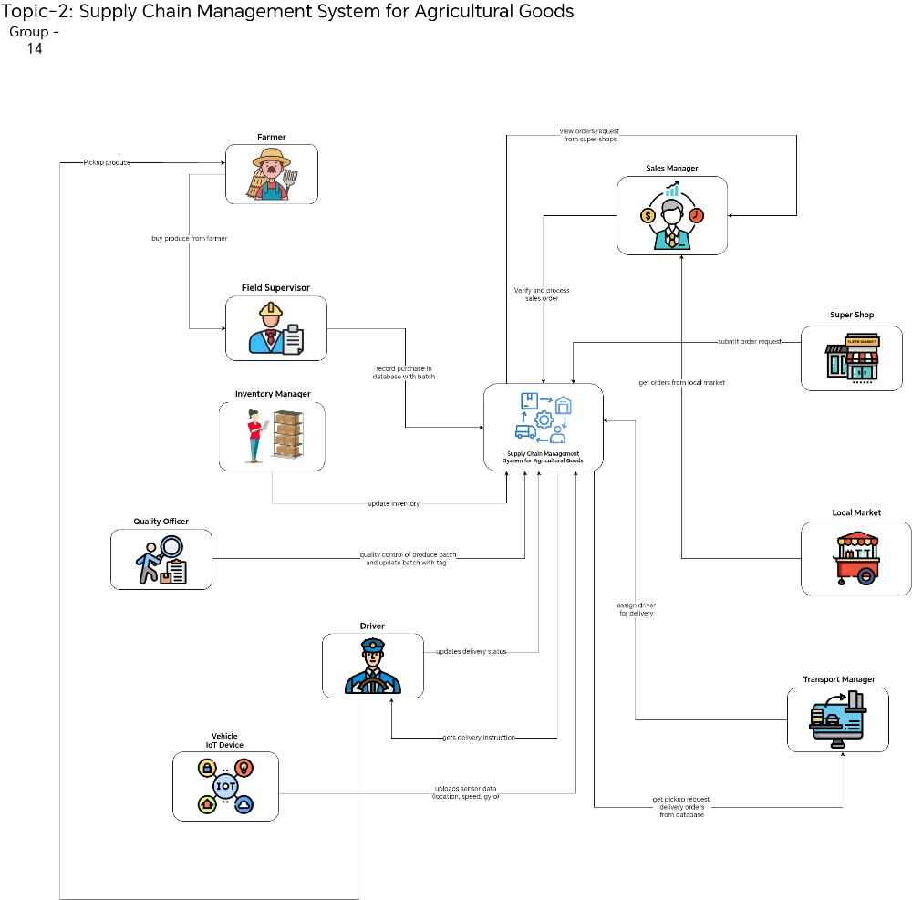
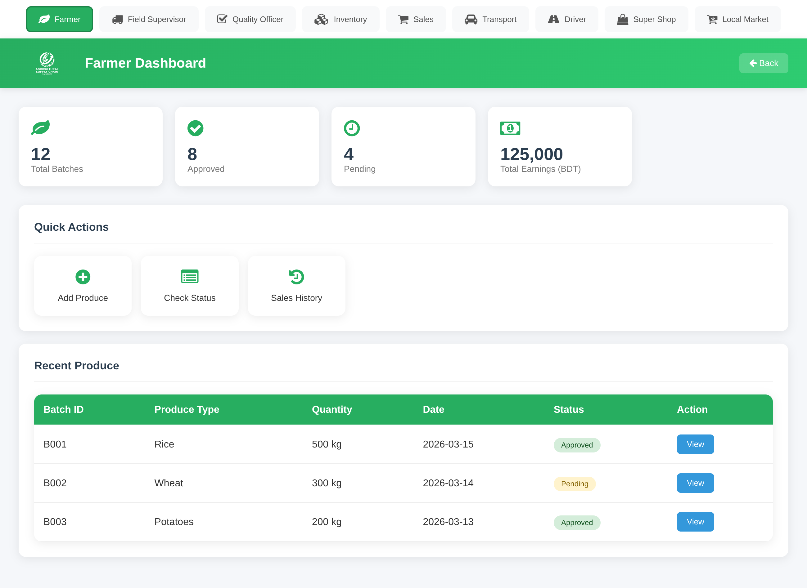
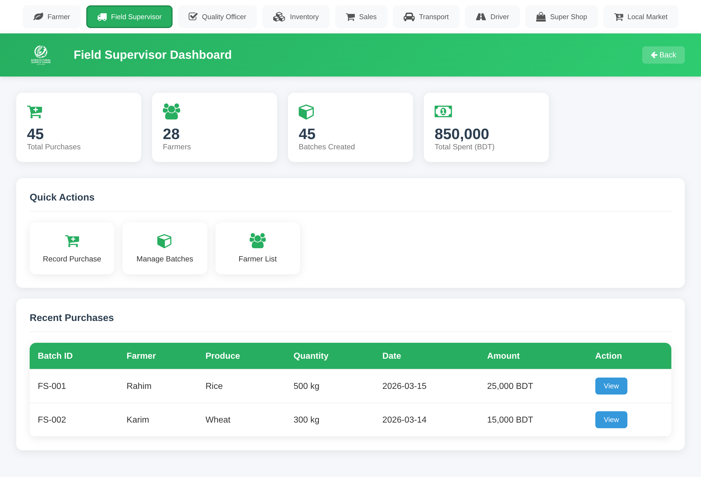
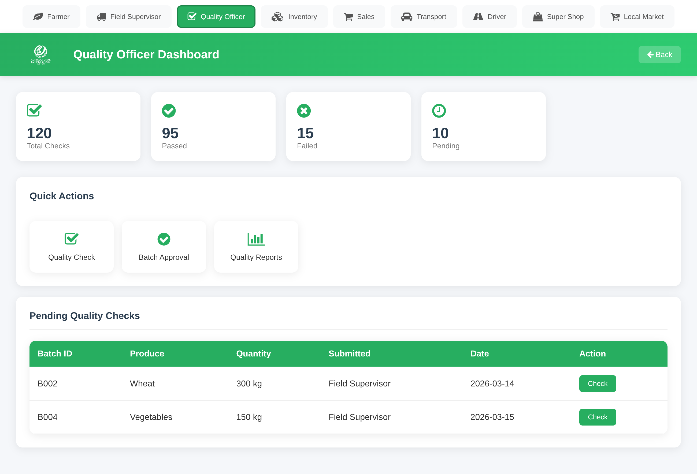
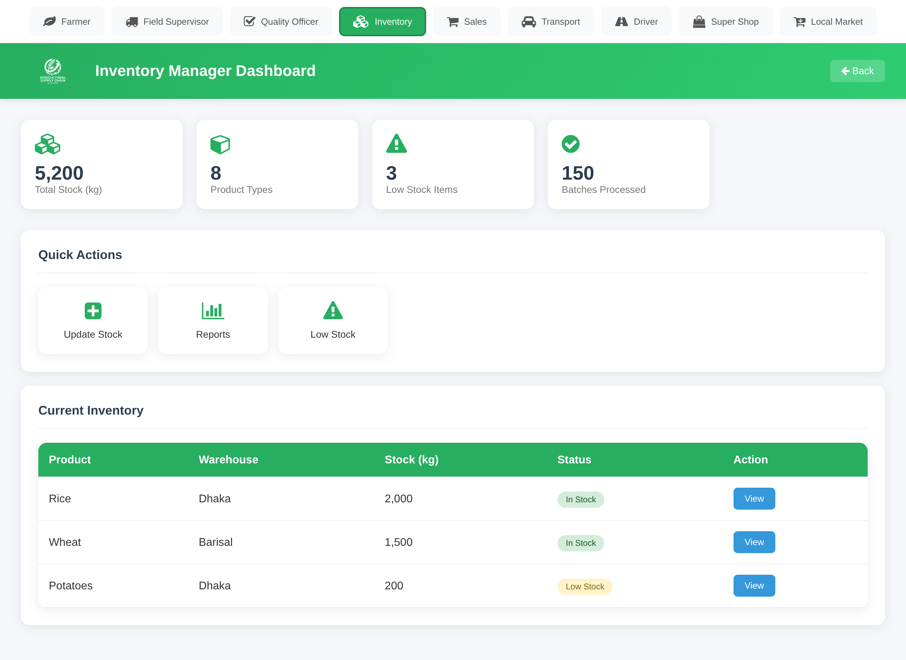
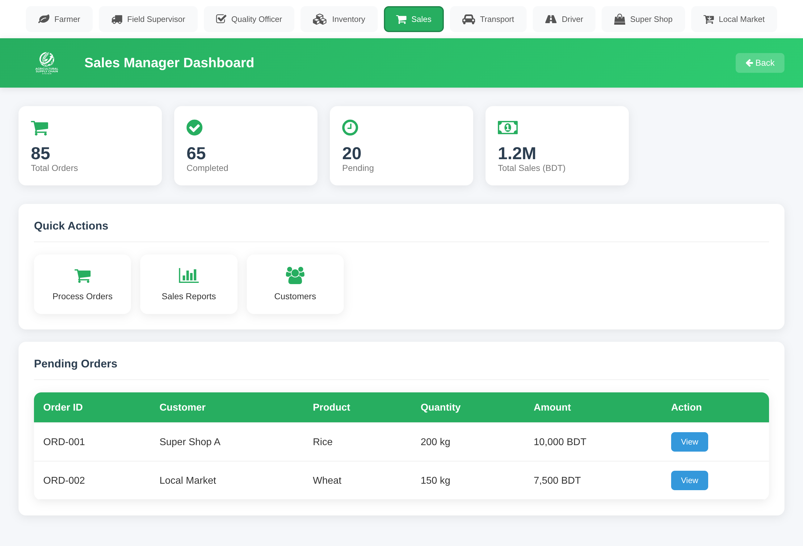
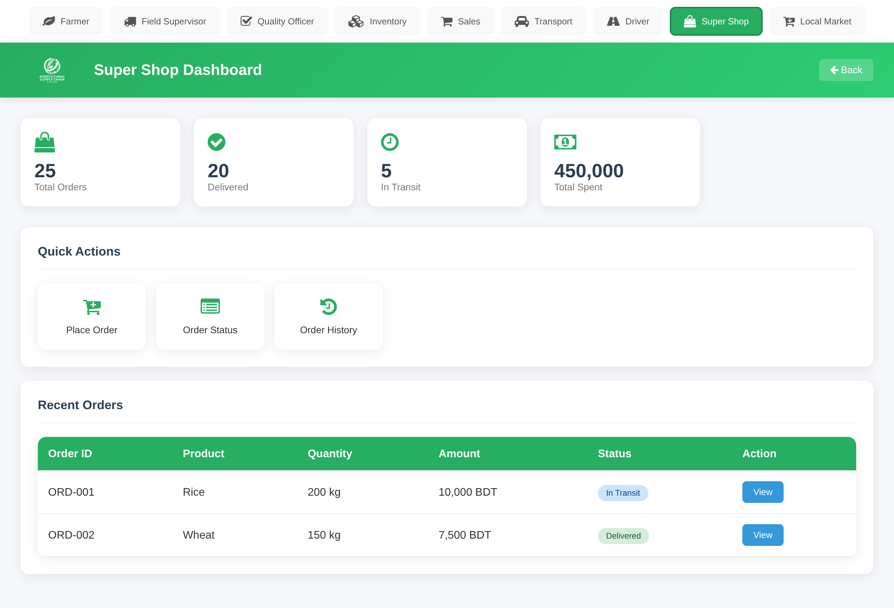
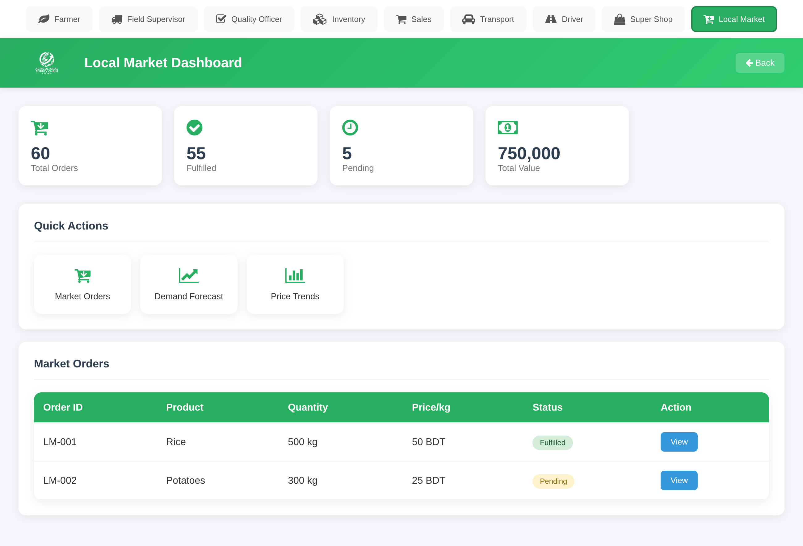
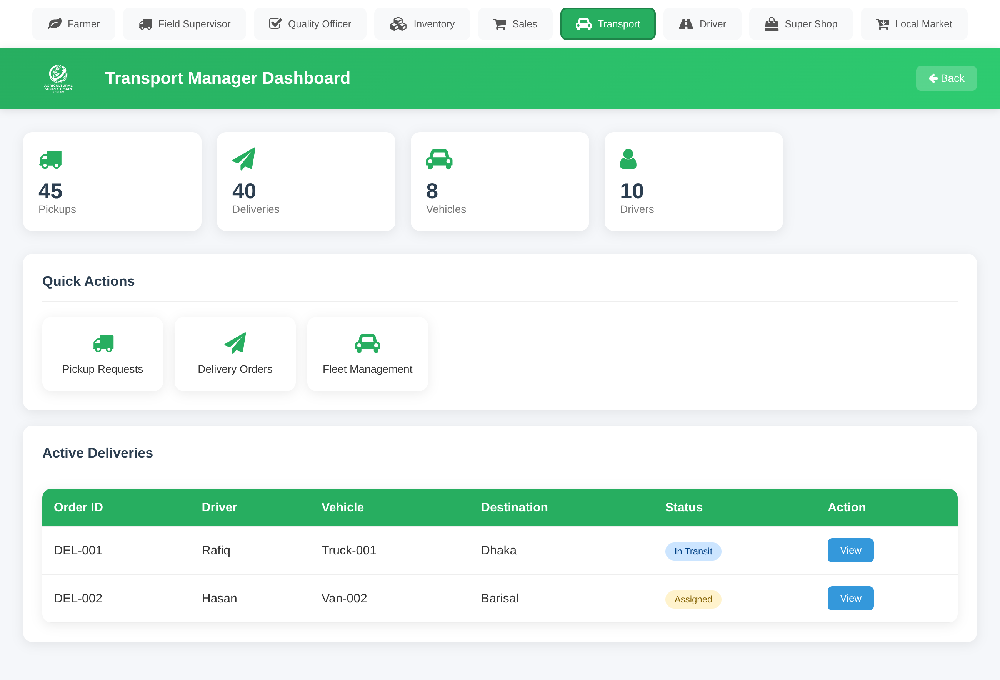
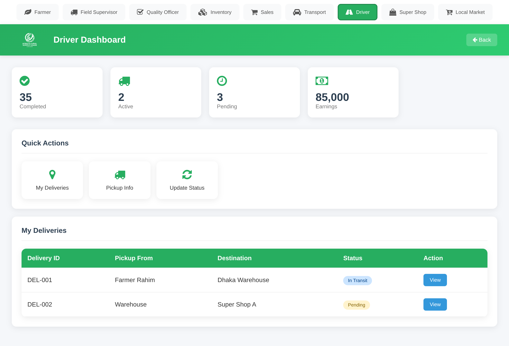

# Supply Chain Management System for Agricultural Goods

## Description:

The Supply Chain Management System for Agricultural Goods serves as a comprehensive, centralized hub connecting stakeholders from the farm level to end consumer markets, facilitating procurement, quality control, inventory management, sales processing, and logistics tracking. The workflow begins with the Farmer, who supplies agricultural produce, which is then purchased by the Field Supervisor and recorded in the system with a specific batch number. Next, a Quality Officer performs quality control and updates the system with a quality tag, while the Inventory Manager simultaneously updates overall stock levels. Sales demand is managed through two channels: the Local Market, which submits order requests to the Sales Manager for verification and processing, and the Super Shop, which submits orders directly to the system. For fulfillment, the Transport Manager pulls pickup and delivery orders from the database and assigns a Driver, who receives instructions via the system to pick up the produce and provides ongoing delivery updates. Finally, a Vehicle IoT Device ensures safety and real-time monitoring by automatically uploading live sensor data including location, speed, and gyroscope metrics directly to the system.

## System Overview

The diagram illustrates a comprehensive **Supply Chain Management System for Agricultural Goods**, acting as a centralized hub that connects various stakeholders from the farm level to the end consumer markets. The system facilitates procurement, quality control, inventory management, sales processing, and logistics tracking.

---

## Process Breakdown by Stakeholders

###  Procurement Phase (Farmer & Field Supervisor)

The process begins with the **Farmer**, who supplies the agricultural produce. The **Field Supervisor** buys the produce directly from the farmer and records this purchase into the central Supply Chain Management System, assigning it a specific batch number.

###  Quality Assurance & Inventory Management

Once logged, a **Quality Officer** conducts quality control on the produce batch and updates the central system with a quality tag. Concurrently, the **Inventory Manager** interacts with the system to update the overall stock levels based on the new, quality-checked batches.

###  Sales & Order Processing

Demand is driven by two main channels:
* **Super Shops:** Submit order requests directly to the **Sales Manager**. The Sales Manager views these requests from the system, verifies them, and processes the sales order. 

* **Local Markets:** The system directly captures orders originating from the local market.

###  Logistics & Transportation

To fulfill these orders, the **Transport Manager** pulls pickup requests and delivery orders from the central database. They then assign a **Driver** for the delivery via the system.

###  Fulfillment & Tracking

The **Driver** receives delivery instructions from the system, proceeds to pick up the produce from the Farmer, and continuously updates the delivery status back into the system. To ensure safety and real-time monitoring, a **Vehicle IoT Device** automatically uploads live sensor data (including location, speed, and gyroscope metrics) directly to the system.